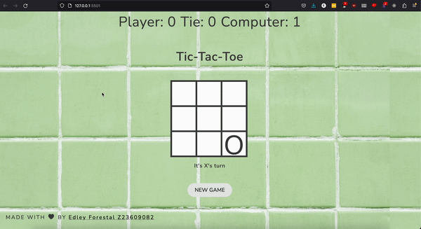

Tic-Tac-Toe Game
Made using JS, HTML, and CSS
Made by Edley Forestal Z23609082

For this Tic-Tac-Toe game
I was tasked with making it so a player can play against the computer.
The way that the game works top down is that it first randomly picks who goes first between the player or computer using the Math.random function the probablity is 50%. As it is generating a number between 0-1, below .5 the player goes first, above .5 the computer goes first.
Then from there if the computer goes first it makes it's move. The way that works is a custom function that compilies all the empty blocks then choses from the aviable spots using Math.random again but from 0-8, each number corresponding with a block on the grid.
On the players side each block on the grid is event driven, said event being the grid getting clicked. After a marking is placed in any grid a function gets called to see if there is a winning combination of blocks marked or if there is a draw between the two players. There is also a status message to show which players turn it is and the game status. Whether a player won or if there is a draw at the end of each match. Also after each match there is a scoreboard up top that tracks all the stats (player wins, draws, and computer wins) from that session (Stats stay there until page is refreshed).